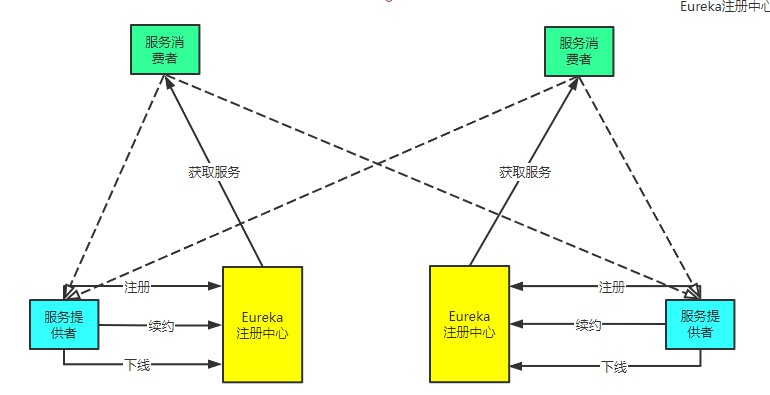
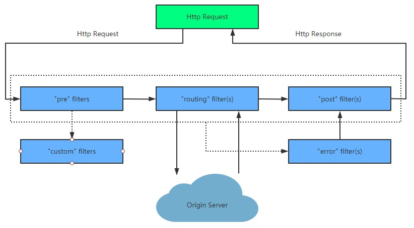
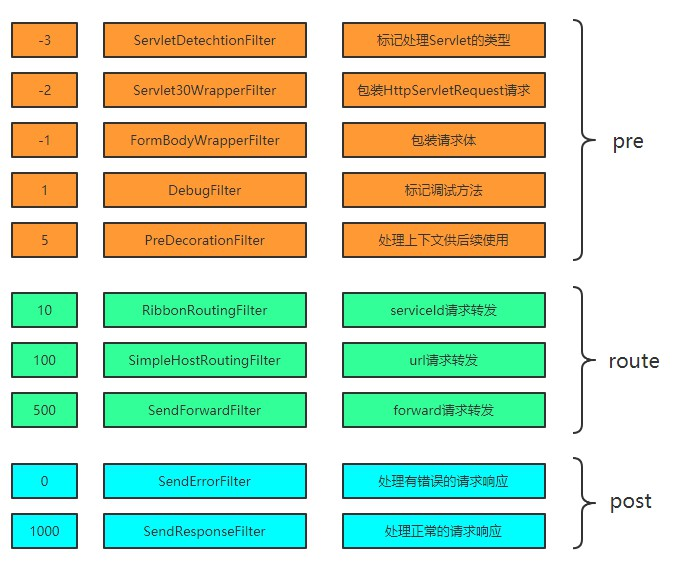
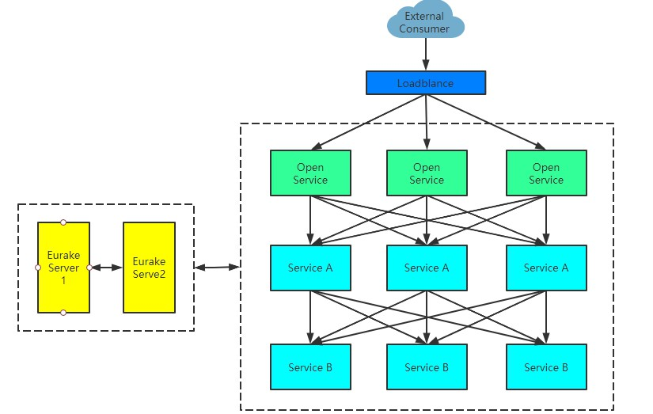

# Spring Cloud Action

## Environment
- Java version: 1.8
- SpringBoot version: 2.2.6.RELEASE
- SpringCloud version: Hoxton.SR4

## Modules
| module| service name| port|
| :---| :---| :---|
| eureka-server| eureka-server| 1111|
| api-gateway| api-gateway| 1120|
| common-api| common-api| -|
| common-service-a| common-service| 1121|
| common-service-b| common-service| 1122|
| consumer-ribbon| ribbon-consumer| 1131|
| consumer-feign| feign-consumer| 1132|

## Test URL
```$xslt
http://localhost:1111/

http://localhost:1121/
http://localhost:1121/book
http://localhost:1122/
http://localhost:1122/book

http://localhost:1131/
http://localhost:1131/book
http://localhost:1132/feign
http://localhost:1132/feign/book

http://localhost:1120/api-a
http://localhost:1120/api-a/book
http://localhost:1120/api-b
http://localhost:1120/api-b/book
http://localhost:1120/api-c/feign
http://localhost:1120/api-c/feign/book

http://localhost:1120/api-a/book/timeout
http://localhost:1131/book/timeout
http://localhost:1132/feign/book/timeout
```

## Eureka


## Zuul Filter
process flow  

presetting filters  


## Sample Micro Soft Struct


> Specifically Thanks To [Jaki2012](https://github.com/jaki2012) 🍖🍳🥘🍋